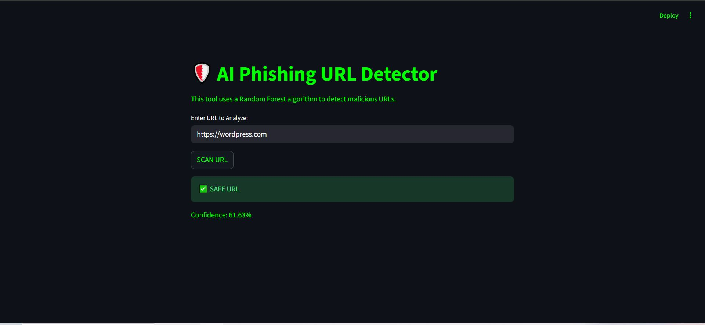
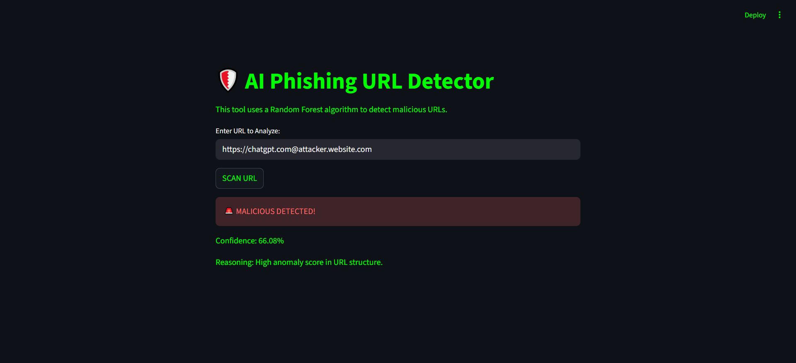
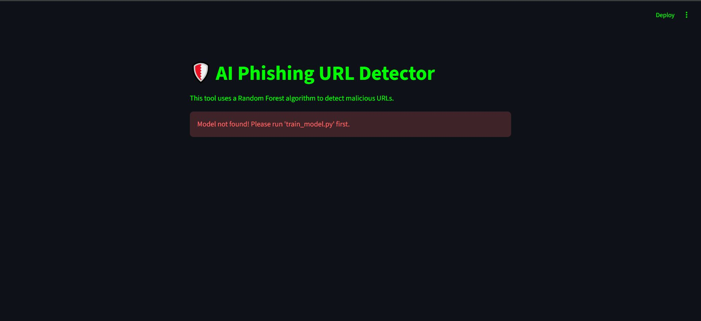

<div align="center">


</div>

<div align="center">


</div>

---

## 🛡️ About The Project

A cybersecurity tool that uses **Machine Learning** to detect phishing and malicious URLs in real time. Built with a **Random Forest classifier** trained on structural URL features, deployed via a clean **Streamlit web interface** with a hacker-themed dark UI.

This project bridges the gap between **offensive security knowledge** and **machine learning** — using the same URL patterns that attackers exploit to build a detection engine against them.

---

## ✨ Features

- 🤖 **Random Forest Classifier** — 100 trees, max_depth=32 for robust detection
- 🔍 **Real-time URL Scanning** — instant safe/malicious verdict with confidence score
- 📊 **7 Hand-Crafted Features** — URL length, dot count, hyphen count, slash count, `@` symbol presence, digit density, sensitive character frequency
- 🎯 **~87% Accuracy** on held-out test set
- ⚠️ **Graceful Error Handling** — clear guidance if model isn't trained yet
- 🖥️ **Dark Hacker-Themed UI** — built with Streamlit

---

## 📸 Screenshots

### ✅ Safe URL Detected


### 🚨 Malicious URL Detected


### ⚠️ Model Not Found Error

> This appears if you run the app before training the model. See setup instructions below.

---

## 🧠 How It Works

```
URL Input
    │
    ▼
Feature Extraction (7 structural features)
    │
    ├── URL Length
    ├── Dot Count
    ├── Hyphen Count
    ├── Slash Count
    ├── '@' Symbol Presence
    ├── Digit Density
    └── Sensitive Char Frequency (?, =, &, %)
    │
    ▼
Random Forest Classifier (100 Trees)
    │
    ▼
Prediction + Confidence Score
    │
    ├── ✅ SAFE URL
    └── 🚨 MALICIOUS DETECTED
```

---

## 📁 Project Structure

```
ai-phishing-detector/
│
├── app.py              # Streamlit web application
├── train_model.py      # Model training script
├── requirements.txt    # Dependencies
├── project-report.pdf  # Detailed project report
└── screenshots/        # UI screenshots
    ├── safe.png
    ├── malicious.png
    └── error.png
```

---

## ⚙️ Setup & Installation

### Prerequisites
- Python 3.8+
- pip

### Step 1 — Clone the repository
```bash
git clone https://github.com/mohib-ilyass/ai-phishing-detector.git
cd ai-phishing-detector
```

### Step 2 — Install dependencies
```bash
pip install -r requirements.txt
```
### Step 3 — Download the Dataset
Download the dataset from Kaggle:
👉 [Malicious URLs Dataset](https://www.kaggle.com/datasets/sid321axn/malicious-urls-dataset)

Rename the downloaded file to `dataset.csv` and place it in the root folder.

### Step 4 — Train the model first ⚠️
```bash
python train_model.py
```
> This generates `phishing_model.pkl`. **Must be done before running the app.**

### Step 5 — Launch the app
```bash
streamlit run app.py
```

---

## 📦 Requirements

```
streamlit
scikit-learn
pandas
pickle-mixin
```

---

## 🎯 Model Performance

| Metric | Value |
|--------|-------|
| Algorithm | Random Forest |
| Number of Trees | 100 |
| Max Depth | 32 |
| Test Accuracy | ~87% |
| Features Used | 7 |
| Training Mode | Full dataset (80/20 split) |

---

## 👨‍💻 Author

**Mohib Ilyass**
- 🌐 [GitHub](https://github.com/mohib-ilyass)
- 💼 [LinkedIn](https://linkedin.com/in/mohibilyass)
- 🔐 [TryHackMe](https://tryhackme.com/p/mohibilyass)

---

## 📄 Project Report
A detailed academic report covering methodology, feature engineering, 
model evaluation, and results.

> 🎓 Developed as part of the **Artificial Intelligence** course at  
> **COMSATS University Islamabad** under the supervision of **Sir Yasir Munir**

👉 [View Full Report](project-report.pdf)

<div align="center">


</div>
